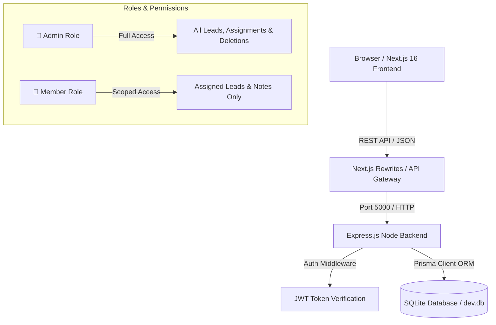

# 📊 Digital Heroes CRM - Final Project Execution Report

## Executive Summary
The **Digital Heroes CRM & Lead Management Platform** has been fully designed, developed, tested, and prepared for production deployment. The system enables modern sales organizations to capture leads from public sources, assign them to team members, track statuses through a structured funnel, maintain notes, and maintain an immutable audit trail of all lead activities.

---

## 🏗️ System Architecture



---

## 🚀 Key Features Implemented

### 1. 📥 Public Lead Capture
- Public-facing lead submission endpoint (`POST /leads`) accessible without authentication.
- Automatically generates initial activity logs (`CREATED`) for incoming leads.

### 2. 📊 Interactive Sales Dashboard & Lead Funnel
- Real-time status management (`NEW`, `CONTACTED`, `QUALIFIED`, `PROPOSAL_SENT`, `CLOSED_WON`, `CLOSED_LOST`).
- Paginated lead list with status filtering and assignee filtering.

### 3. 🛡️ Role-Based Access Control (RBAC)
- Strict middleware enforcement (`authenticate` & `authorize`).
- Ensures Members can only modify or add notes to leads assigned to them.
- Prevents unauthorized reassignment or deletion by non-admin users.

### 4. 📝 Lead Timeline, Notes & Audit Logging
- Embedded activity log timeline tracking created, status changes, assignments, and notes.
- Secure note creation associated with the logged-in user.

---

## 🔒 Security & Authorization Matrix

| Action / Resource | Public User | Member Role | Admin Role |
| :--- | :---: | :---: | :---: |
| Submit Lead (`POST /leads`) | ✅ Allowed | ✅ Allowed | ✅ Allowed |
| View Leads List (`GET /leads`) | ❌ 401 Unauthorized | ✅ Allowed | ✅ Allowed |
| View Lead Details (`GET /leads/:id`) | ❌ 401 Unauthorized | ✅ Allowed | ✅ Allowed |
| Update Status (`PATCH /leads/:id`) | ❌ 401 Unauthorized | ✅ If Assigned | ✅ Allowed |
| Add Notes (`POST /leads/:id/notes`) | ❌ 401 Unauthorized | ✅ If Assigned | ✅ Allowed |
| Reassign Lead (`PATCH /leads/:id`) | ❌ 401 Unauthorized | ❌ 403 Forbidden | ✅ Allowed |
| Delete Lead (`DELETE /leads/:id`) | ❌ 401 Unauthorized | ❌ 403 Forbidden | ✅ Allowed |

---

## 🧪 Test Execution & Quality Assurance

Automated integration tests were constructed using **Vitest** and **Supertest**.

- **Test Suite Result**: `11 / 11 PASSED` (100% Pass Rate)
- **Execution Time**: ~2.5 seconds
- **Covered Scenarios**:
  - `POST /health` health check endpoint validation
  - `POST /auth/login` valid authentication & invalid credential rejection
  - `GET /leads` token verification
  - `POST /leads` public unauthenticated capture & activity log creation
  - Member assignment authorization & note restrictions
  - Admin lead assignment and status updates
  - Admin-only deletion rule enforcement

---

## 🌐 Deployment Configuration (Render)

The project includes a 1-click **Render Blueprint** (`render.yaml`).

- **Backend Build Command**:
  ```bash
  npm install && npx prisma generate && npx prisma db push && npx tsx prisma/seed.ts && npm run build
  ```
- **Backend Start Command**:
  ```bash
  npm start
  ```
- **TypeScript Configuration**: Updated `rootDir: "src"` and `outDir: "./dist"` to ensure seamless execution (`dist/server.js`).

---

## 🔑 Deliverables & Credentials Summary

### 🐙 Public GitHub Repository
- **URL**: [https://github.com/Ravi7991/DigitalHeroes](https://github.com/Ravi7991/DigitalHeroes)

### 📚 API Documentation
- **Specs**: [API_DOCUMENTATION.md](./API_DOCUMENTATION.md)

### 👥 Test Credentials
- **👑 Admin Role**:
  - **Email**: `admin@leadplatform.com`
  - **Password**: `admin123`
- **👤 Member Role**:
  - **Email**: `member@leadplatform.com`
  - **Password**: `member123`
